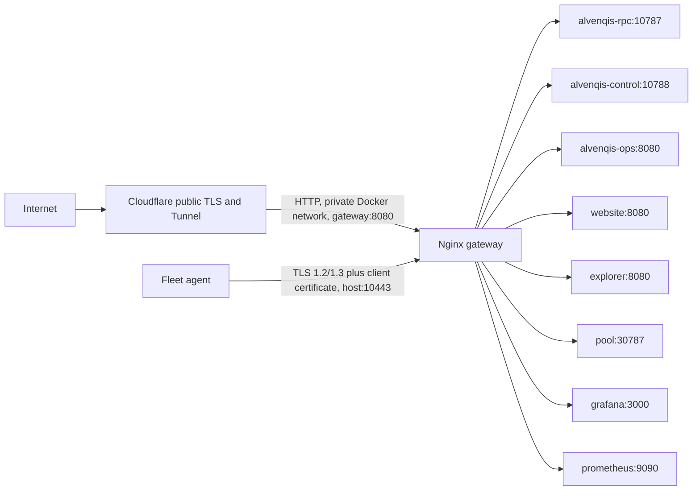

# Pingora edge migration design

Status: **Owner-approved implementation in repository; live cutover pending canary evidence**
Date: 2026-08-01; implementation status refreshed 2026-08-08
Scope: project-operated `alvenqis-setup-external` edge only

This design replaces the project edge Nginx process with a Rust service built
on Pingora. It does not change consensus, P2P, Stratum, chain data, wallets,
independent-operator roles, 1Panel, or any service outside the Alvenqis Docker
network. The owner subsequently directed the project to replace the edge Nginx
gateway with Pingora before the remaining deployment/release work, authorizing
the reviewed pinned-commit path. This document retains the pre-migration
topology and acceptance requirements so the cutover remains auditable.

"Nginx replacement" in this document means the edge reverse proxy under
`alvenqis-setup-external/docker/gateway/`. The website and explorer currently
use separate Nginx processes only to serve their static SPA assets; those are
not edge proxies and are outside this migration. Removing those static servers
would be a separate owner-approved application-image change.

## 1. Design goals and non-goals

Goals:

- preserve every current host, route, status code, authentication boundary,
  header rule, body limit, timeout, and Cloudflare origin contract;
- keep the public RPC mining boundary fail-closed: `/mining/*` returns HTTP 410
  at the edge;
- keep fleet enrollment on the tunneled HTTP host and fleet report/rotation on
  the separate direct mTLS host;
- preserve viewer/operator RBAC and the gateway-to-controller proxy token;
- add explicit upstream health state, bounded local rate limiting, structured
  metrics, and failure isolation;
- run as an unprivileged, read-only Docker service with no Docker socket and no
  fleet CA private key;
- retain an immediate image-level rollback path during cutover.

Non-goals:

- Pingora is not required by a node, RPC, indexer, explorer, pool, or solo miner
  operated independently of the project;
- this migration does not create the planned Pingora dashboard;
- it does not move or reconfigure 1Panel, host-level services, P2P TCP, Stratum
  TCP/TLS, Cloudflare account security, or services outside the Compose project;
- it does not introduce proxy caching. Pingora's official project describes
  proxy-cache integration as experimental and the current edge has no cache;
- it does not claim multi-host availability. The project edge remains a
  single-host operational component until a separately evidenced topology
  change exists.

## 2. Pre-migration edge topology

Before the pending cutover, the active VPS edge is the Compose service
`gateway` running the recorded Nginx image. Cloudflare Tunnel sends all
tunneled HTTP hostnames to `http://gateway:8080`. Docker publishes only the
direct fleet mTLS listener, `${FLEET_MTLS_BIND_ADDRESS}:10443`; port 8080 is not
published on the host.

Current routing contract:

| Listener / host | Route | Upstream or response | Current boundary to preserve |
|---|---|---|---|
| `:8080`, unknown host | `/gateway-health` | local HTTP 200 | Container health only; other paths 404. |
| `CONTROL_HOST` | `/setup/*`, `/ops/*` | `alvenqis-ops:8080` | Operator/viewer Basic authentication at the host boundary. |
| `CONTROL_HOST` | all other paths | `alvenqis-control:10788` | Basic authentication; overwrite authenticated user/role headers and inject `X-Alvenqis-Proxy-Token`. |
| `FLEET_HOST` | `/fleet/status` | controller `/public/topology` | Public read, trusted proxy token injected. |
| `FLEET_HOST` | `/fleet/enroll` | controller | No client certificate; five concurrent connections and 5 requests/second with burst 5; client-cert headers cleared. |
| `FLEET_HOST` | `/fleet/report`, `/fleet/certificate/rotate` | local HTTP 426 | Forces agents to use the dedicated mTLS endpoint. |
| `FLEET_MTLS_HOST:10443` | `/fleet/report` | controller | TLS 1.2/1.3, required fleet-CA client certificate, 512 KiB body cap, 20 concurrent connections, rate-limited, verified fingerprint headers overwritten. |
| `FLEET_MTLS_HOST:10443` | `/fleet/certificate/rotate` | controller | Same mTLS boundary with the smaller rotation burst. |
| `RPC_HOST` | `/mining/*` | local HTTP 410 | Never forwarded by the public edge. |
| `RPC_HOST` | `/pool`, `/pool/*` | `alvenqis-pool:30787` | Public pool read surface. |
| `RPC_HOST` | all other paths | `alvenqis-rpc:10787` | 1 MiB body cap; bounded connect/read/write timeouts. |
| `GRAFANA_HOST` | all | `grafana:3000` | Grafana retains its own authentication. |
| `PROMETHEUS_HOST` | all | `prometheus:9090` | Basic authentication at the edge. |
| `POOL_HOST` | all | `alvenqis-pool:30787` | Project-operated pool web/API surface. |
| `WEBSITE_HOST`, `WWW_HOST` | all | `alvenqis-website:8080` | Public website. |
| `EXPLORER_HOST` | all | `alvenqis-explorer:8080` | Public explorer. |

The existing implementation also adds security response headers, forwards
WebSocket upgrades, uses structured access logs, applies 3-second upstream
connect and 90-second send/read timeouts, and maintains upstream keep-alive
pools. Evidence is in
`docker/gateway/nginx.conf.template`, `docker/gateway/gateway-entrypoint.sh`,
`compose/project-edge.yaml`, and `scripts/cloudflare-bootstrap.sh` below the
active `alvenqis-setup-external` package.

Current-state gaps to correct rather than reproduce:

- role selection accepts `CLOUDFLARE_MODE=dns`, but the Cloudflare bootstrap
  rejects that mode and the direct overlay publishes only cleartext port 80,
  with no ordinary HTTPS listener;
- tunneled fleet limits use the connector TCP address, so requests reaching the
  edge through one `cloudflared` connector can share a limiter bucket;
- direct-mode traffic can currently supply `CF-Connecting-IP` without proving
  that the peer is a trusted Cloudflare connector;
- `/gateway-health` is process-local and does not describe upstream health;
- `CLOUDFLARE_PROXY_HTTP` is generated but has no active consumer.

The first Pingora release therefore supports the current production Tunnel
origin plus direct fleet mTLS. Ordinary direct-DNS web exposure remains
fail-closed until a provider-neutral TLS certificate source, HTTPS listener,
renewal path, and redirect policy receive a separate design approval. The
installer and validation scripts must report that limitation explicitly rather
than silently exposing cleartext HTTP.

## 3. Approved Pingora component

Add a workspace crate named `alvenqis-pingora-gateway` and a dedicated
multi-stage Docker image. Pingora `0.8.1` is the API/design reference current on
this document's date, but its crates.io dependency graph is **not approved for
implementation**. A minimal resolution of that release brings
`prometheus 0.13.4 -> protobuf 2.28.0`; `cargo audit` flags
`RUSTSEC-2024-0437`, an uncontrolled-recursion denial-of-service advisory. The
upstream Pingora dependency issue remains open. Adding that graph would violate
this repository's required dependency gate.

Before any Pingora code is added, the owner must approve one of these sources:

1. **Preferred:** a released Pingora version whose freshly resolved graph has
   no disallowed advisory and passes the repository's license/source policy;
2. **Reviewed immediate path:** an exact, immutable commit from the official
   Cloudflare repository, only after its complete resolved graph, delta from
   the last release, license/source policy, and required API surface are
   reviewed. The SHA must be pinned in the manifest and lockfile and recorded
   in the dependency report. Floating `main` is forbidden.

An upstream commit currently separates Prometheus integration from
`pingora-core`, but it is unreleased; that observation is evidence for the
reviewed-commit option, not permission to consume a moving branch. Vendoring or
patching is not allowed silently and would require its own owner-visible source
and maintenance decision.

The approved dependency is official upstream commit
`402acae52ff29c4183b9eca55ffa3f77814a5ee0`. A clean minimal manifest pinned to
that exact revision made `cargo audit` exit 0 and removed `protobuf 2.28.0` from
the resolved graph; the allowed unmaintained warning for `derivative 2.2.0`
remained. The workspace source-policy allowlist is restricted to this exact Git
source, and the dated dependency report records the audit/deny evidence. The
Prometheus separation itself entered upstream in commit
`842ddd9fac9ee8570eb1e5b8ea208fbc88e7671c`.

Use the OpenSSL backend for the first implementation because Pingora's official
project labels its rustls backend experimental and the current host already
carries OpenSSL. A fresh `cargo audit`, `cargo deny check`, maintenance review,
and license/source check are mandatory at the dependency gate and again before
cutover.

The Compose service name remains `gateway`. This deliberately preserves:

- Cloudflare Tunnel origin `http://gateway:8080`;
- Docker DNS and dependency names;
- the `ALVENQIS_GATEWAY_IMAGE` override;
- the private port 8080 and published port 10443 contract;
- existing memory, CPU, PID, read-only, tmpfs, healthcheck, secret, PKI mount,
  and network guardrails.

The active image changes from an Nginx image to the Pingora binary. After
acceptance and rollback capture, remove the Nginx Dockerfile, template,
entrypoint, package references, tests, and documentation rather than retaining
two active edge implementations. This cleanup is limited to the edge gateway;
the website and explorer static-SPA server images are unchanged.

## 4. Configuration model

The gateway loads a strongly typed, deny-unknown-fields application config.
Ordinary topology values come from the existing environment variables. Secret
values are read directly from Docker secret files and are never serialized to
the generated config, command line, logs, metrics, or health response.

Configuration groups:

- listeners: private HTTP `0.0.0.0:8080`, direct mTLS `0.0.0.0:10443`, and an
  internal-only Prometheus metrics listener;
- exact host allowlist from `CONTROL_HOST`, `RPC_HOST`, `FLEET_HOST`,
  `FLEET_MTLS_HOST`, `GRAFANA_HOST`, `PROMETHEUS_HOST`, `POOL_HOST`,
  `WEBSITE_HOST`, `WWW_HOST`, and `EXPLORER_HOST`;
- upstream Docker DNS name, port, health path, timeout, and route class;
- body-size, connection, request-rate, retry, and response-header policies;
- Docker secret paths for operator password, viewer password, and controller
  proxy token;
- PKI paths for fleet CA certificate and fleet server certificate/key.

Startup fails closed when a required host is empty/duplicated, a port is out of
range, a secret is missing or malformed, a certificate/key pair does not match,
the configured server hostname is not in the certificate SAN, or a fleet CA
private key is visible in the gateway mount. A `--check-config` mode performs
the same validation without binding sockets.

Docker names must be resolved without panic and refreshed on a bounded cadence.
The implementation must not call an API path that unwraps failed DNS lookup.
Use a small background service-discovery cache with last-known-good addresses,
a fixed maximum entry count, a 10-second refresh target, and explicit
unavailable state when no validated address exists.

## 5. Request handling and trust boundaries

Pingora's `ProxyHttp` phases map to the required policy as follows:

- `early_request_filter` / `request_filter`: validate Host and method, choose
  route, enforce body and rate limits, authenticate Basic credentials, reject
  forbidden paths, and short-circuit local 404/410/426 responses;
- `upstream_peer`: choose only a healthy address from the route's allowlisted
  upstream set and apply explicit connect/read/write/idle timeouts;
- `upstream_request_filter`: remove untrusted forwarding, admin, certificate,
  and proxy-token headers, then write the canonical values for this request;
- `response_filter`: apply the existing security headers without deleting
  required upstream headers;
- `fail_to_connect` / `fail_to_proxy`: produce stable 502/503 responses and
  increment bounded metrics;
- `logging`: emit one structured record without credentials, tokens,
  certificate PEM, query secrets, or request bodies.

Host matching uses a normalized host without an optional port and rejects
invalid/multiple Host values. Unknown hosts return 404 and never receive a
default upstream.

Client-IP policy:

- the direct 10443 listener uses the actual TCP peer and never trusts a
  Cloudflare header;
- the private 8080 listener may accept `CF-Connecting-IP` only from the
  dedicated Cloudflare-ingress Docker network; all other callers use the TCP
  peer address;
- inbound `X-Forwarded-*`, `X-Alvenqis-Admin-*`,
  `X-Alvenqis-Client-*`, and `X-Alvenqis-Proxy-Token` values are removed before
  canonical values are written.

This intentionally changes the current limiter key for tunneled traffic from
the shared connector address to a validated client identity. Tests must prove
that a non-connector peer cannot opt into trusted Cloudflare headers and that
untrusted forwarding values never reach the RPC write limiter.

Add a dedicated `alvenqis-edge-ingress` network containing only `cloudflared`
and `gateway`. Keep upstream connectivity on Alvenqis-owned internal networks;
do not attach the gateway to host networking or any external Docker network.

## 6. Human authentication and controller proxy token

Read the two current password secrets at startup. Decode Basic credentials with
strict size limits and compare credentials in constant time. Viewer and
operator usernames remain distinct and map to the same `viewer` / `operator`
headers consumed by the Rust control service. Authentication failures return
401 with the expected challenge; an authenticated viewer continues to receive
403 from operator-only controller routes.

The 64-hex controller proxy token is read from its existing Docker secret,
validated, held in secret memory, and unconditionally overwritten on every
controller-bound request. Direct access and forged headers remain rejected by
the controller's application-side constant-time check. The token is never sent
to any other upstream.

## 7. TLS and mTLS approach

There are two distinct TLS boundaries:

1. For tunneled public hosts, client TLS terminates at Cloudflare. `cloudflared`
   sends HTTP only across the private ingress network to Pingora on port 8080.
   Pingora does not expose port 8080 on the VPS host. The initial origin leg is
   constrained and tested as HTTP/1.1; HTTP/2 on this leg is deferred until
   shutdown-under-load behavior is proven.
2. Fleet report and certificate rotation connect directly to port 10443, where
   Pingora terminates TLS and requires a certificate issued by the mounted fleet
   CA. Only TLS 1.2 and TLS 1.3 are accepted; session tickets remain disabled.

The gateway mounts only `control/pki/edge`: the CA certificate and server
certificate/key. It must abort if `fleet-ca.key.pem` exists. The control
container remains the only service with the CA signing key.

Before the general proxy is implemented, a focused Pingora/OpenSSL spike must
prove all of the following with automated tests:

- no client certificate fails during the handshake;
- an untrusted certificate fails during the handshake;
- a valid fleet certificate succeeds;
- the application receives the verified leaf certificate and computes the
  same 40-character SHA-1 identifier currently stored by the controller;
- forged certificate headers are stripped and cannot bypass verification;
- hostname/SAN mismatch and server key/certificate mismatch fail startup.

SHA-1 remains only a compatibility identifier after CA validation, not a
signature or trust primitive. Changing stored fleet identity to SHA-256 would
be a separate migration, not an incidental proxy replacement.

Certificate renewal uses atomic files. The initial cutover may restart only the
gateway container after a server certificate change. In-process reload or
Pingora graceful upgrade can be added only after an integration test proves
socket and certificate handoff inside the Docker lifecycle. This design does
not promise zero downtime. Open upstream issues report dropped in-flight HTTP/2
streams during graceful shutdown and delayed shutdown in load-balancer
background work. The first release must test TERM/restart under HTTP/1.1 load,
bound shutdown time, and rely on gateway-only rollback instead of assuming the
general graceful-upgrade claim covers these cases.

## 8. Upstream health, selection, retry, and failure isolation

Define active health checks per service:

| Upstream | Health target |
|---|---|
| RPC | `/health` |
| Control | `/health` |
| Ops | `/health` |
| Website | `/healthz` |
| Explorer | `/healthz` |
| Pool | `/health` |
| Grafana | `/api/health` |
| Prometheus | `/-/healthy` |

Health checks run as Pingora background services with bounded frequency,
timeout, concurrency, and jitter. A noncritical upstream failure marks only its
routes unavailable. It must not make `/gateway-health`, public RPC, or another
healthy service unavailable. Gateway readiness means config, listeners, secret
boundaries, and background workers are initialized; individual upstream health
is exported separately.

There is one instance of each upstream today, so the first release performs
health-aware selection, not fictional multi-origin load balancing. The config
format permits multiple explicitly configured addresses later.

Retries are conservative:

- at most one connect-stage retry for GET/HEAD when nothing was sent upstream;
- no automatic retry of transaction submission, fleet enrollment/report,
  certificate rotation, admin mutation, or any other non-idempotent request;
- no retry after response headers or a request body may have reached upstream.

This follows Pingora's official failover guidance that non-idempotent requests
must not be retried after they may have been sent.

## 9. Rate limiting and DDoS controls

Apply defense in depth in `request_filter`, independent of optional Cloudflare
plan features:

- retain the current fleet limits exactly at migration;
- add configurable, separately measured buckets for RPC reads, transaction
  submit, control authentication, public pool, and static site traffic only
  after baseline traffic is measured;
- use actual client IP according to the trust policy above, never an arbitrary
  forwarded header;
- cap concurrent connections per listener and route class;
- reject oversized request headers and bodies before buffering or proxying;
- apply bounded timeouts and disable unbounded request-body accumulation;
- store limiter keys in a sharded TTL/LRU structure with an explicit maximum,
  so random-source churn cannot create unbounded memory growth;
- return 429 with stable rate-limit headers and metrics, without reflecting
  attacker input.

The implementation may use `governor` as specified by `reform.md`, called from
Pingora's request filter. Pingora's own official `pingora-limits` example is a
reference, not a reason to accept unbounded client-key state. Cloudflare WAF and
rate rules remain an additional outer layer for tunneled hosts; direct mTLS
still depends on the local listener, UFW, certificate verification, and local
limits.

## 10. Headers, WebSocket, compression, and caching

- Preserve WebSocket upgrade behavior for routes that need it; test Grafana and
  any dashboard stream explicitly.
- Preserve `Host`, canonical `X-Forwarded-For`, `X-Forwarded-Host`, and
  `X-Forwarded-Proto` while stripping hop-by-hop and forged protected headers.
- Preserve `X-Content-Type-Options`, `X-Frame-Options`, `Referrer-Policy`, and
  `Permissions-Policy` response headers.
- Preserve response compression only through a tested Pingora compression
  module or the existing upstream behavior; do not add a second compression
  layer blindly.
- Do not enable Pingora cache in the first release.

## 11. Observability and auditability

Expose an internal-only Prometheus endpoint with at least:

- requests, responses, status classes, bytes, and latency by bounded route ID;
- rate-limit and authentication rejections;
- active connections by listener;
- upstream health, connection attempts, failures, retries, and latency;
- mTLS handshake success/failure categories without certificate identity;
- config load/reload success and process build metadata.

Labels must never contain raw path, query, Host outside the allowlist, IP,
username, token, node ID, or certificate fingerprint. Structured logs use a
generated request ID and allowlisted route ID. Admin mutation audit remains in
the controller; the proxy must not present access logs as an append-only admin
audit log.

## 12. Dashboard boundary

The planned Pingora dashboard is a later, separately reviewed deliverable. It
must be visibly labeled **project-operated infrastructure tooling**. It is not
a node requirement, consensus component, P2P discovery service, validator
authority, or network governance system.

When designed, it must:

- run only in the explicit project-edge profile;
- use viewer/operator RBAC plus WebAuthn/FIDO2 or approved 2FA;
- have no Docker socket and no fleet CA signing key;
- expose allowlisted operational actions only, with controller-side
  authorization and audit records;
- fail without interrupting proxy data-plane operation;
- never appear in the independent-operator installation path.

`Blockchain-docs/human/operator/INDEPENDENT_NODE_OPERATOR_GUIDE.md` must keep
working with zero Pingora or dashboard dependency. A repository check will
reject Pingora references in that guide and reject project-edge overlays in
independent role definitions.

## 13. Implementation and cutover sequence

1. **Dependency-source gate:** resolve the owner-approved source in a clean
   lockfile, run dependency, advisory, maintenance, license, and source checks,
   and record the exact version or commit. Stop on any disallowed result.
2. **mTLS feasibility gate:** add only the approved minimal Pingora graph and a
   focused TLS harness. Stop if downstream client-certificate verification or
   identity extraction cannot meet the current contract.
3. **Core proxy:** implement typed config, host/path routing, protected-header
   overwrite, Basic RBAC, local responses, upstream selection, health, limits,
   metrics, and unit/property tests.
4. **Container and Compose canary:** add an internal-only canary service on a
   non-public port. It receives no Cloudflare route and does not bind 10443.
5. **Differential test:** send the same synthetic host/path/method/body/header
   matrix to Nginx and Pingora and compare status, relevant headers, body class,
   upstream selection, and protected-header behavior.
6. **mTLS canary:** in an isolated Compose network, prove positive and negative
   TLS handshakes, report authentication, rotation, and rate limits.
7. **Cutover:** preserve the old image digest, change the `gateway` image/build
   to Pingora, run preflight, recreate only the gateway, and run public/private
   probes. Cloudflare origin and DNS remain unchanged.
8. **Rollback or accept:** automatically restore the prior image on any route,
   auth, TLS, health, or RPC-contract mismatch. After acceptance, remove active
   Nginx sources/references and update all package, architecture, operator,
   security, release, CI, and validation documentation.
9. **Post-cutover soak:** bounded error/latency/resource observation plus
   backup and restart checks before a release artifact is prepared.

No implementation step may touch 1Panel, frozen
`alvenqis-release/vps/`, genesis, consensus, chain data, wallets, or a Docker
network outside this Compose project.

## 14. Acceptance matrix

Cutover is blocked until automated and live evidence covers:

- `cargo fmt`, tests, clippy with warnings denied, `cargo audit`, and
  `cargo deny check` for the updated workspace, with no newly introduced
  disallowed advisory;
- malformed host/header/body/config property tests and bounded fuzzing of the
  application config and routing parser;
- unknown host 404 and `/gateway-health` 200;
- public RPC `/health` 200, `/status` 200, malformed transaction 422, and both
  `/mining/template` and `/mining/submit` 410;
- Docker-private pool template still available to the pool;
- control unauthenticated 401, viewer read 200, viewer mutation 403, operator
  mutation allowed, and forged admin/proxy headers rejected;
- fleet HTTP report/rotate 426, enrollment contract and throttling, mTLS no-cert
  rejection, untrusted-cert rejection, valid report 204, and rotation;
- Prometheus authentication, Grafana, pool, website, explorer, and WebSocket
  compatibility;
- response security headers, body caps, timeouts, rate limits, and bounded
  limiter memory;
- one upstream outage does not take unrelated routes or gateway health down;
- container runs unprivileged/read-only, has no Docker socket or CA private key,
  and exposes only the approved host port;
- Cloudflare Tunnel keeps `http://gateway:8080`; `fleet-mtls` remains DNS-only;
- Tunnel-origin HTTP/1.1 and bounded TERM/restart behavior are proven under
  concurrent requests; HTTP/2 origin remains disabled for the first cutover;
- all selected services return healthy, Vaultwarden is untouched, and chain
  height/tip are unchanged by edge replacement;
- the independent role matrix and operator guide have zero Pingora/dashboard
  dependency.

## 15. Rollback

Before cutover, record the prior Nginx image digest and rendered Compose config.
Keep that immutable image available for at least one release window. Because
the service name, ports, environment, secrets, PKI mount, and Cloudflare origin
stay compatible, rollback is an image override plus gateway-only recreation;
it does not restore data or touch volumes.

Rollback triggers include startup/health failure, status-code drift, failed
mTLS verification, protected-header regression, elevated 5xx/latency/resource
use, or any unrelated-service availability regression. After rollback, capture
logs and evidence before another attempt.

## 16. Source basis

Repository contract:

- `InternalAI/03_MASTER_BUILD_DIRECTIVE.md` Phase 4;
- `reform.md` Phase 4 corrected scope;
- `InternalAI/01_DECENTRALIZATION_DIRECTIVE.md` project/independent boundary;
- `alvenqis-setup-external/docker/gateway/nginx.conf.template`;
- `alvenqis-setup-external/docker/gateway/gateway-entrypoint.sh`;
- `alvenqis-setup-external/compose/project-edge.yaml`;
- `alvenqis-setup-external/scripts/cloudflare-bootstrap.sh`.

Primary Pingora references:

- [Cloudflare Pingora repository and feature/support statement](https://github.com/cloudflare/pingora);
- [Pingora 0.8.1 release](https://github.com/cloudflare/pingora/releases/tag/0.8.1);
- [official request phases and filters](https://github.com/cloudflare/pingora/blob/main/docs/user_guide/phase.md);
- [official upstream peer and timeout/TLS options](https://github.com/cloudflare/pingora/blob/main/docs/user_guide/peer.md);
- [official failover safety guidance](https://github.com/cloudflare/pingora/blob/main/docs/user_guide/failover.md);
- [official rate-limiter guide](https://github.com/cloudflare/pingora/blob/main/docs/user_guide/rate_limiter.md);
- [official Prometheus integration guide](https://github.com/cloudflare/pingora/blob/main/docs/user_guide/prom.md);
- [official graceful restart guide](https://github.com/cloudflare/pingora/blob/main/docs/user_guide/graceful.md).

Dependency and rollout constraints:

- [RustSec advisory RUSTSEC-2024-0437](https://rustsec.org/advisories/RUSTSEC-2024-0437.html);
- [Pingora issue #875: Prometheus dependency advisory](https://github.com/cloudflare/pingora/issues/875);
- [official commit separating Prometheus integration](https://github.com/cloudflare/pingora/commit/842ddd9fac9ee8570eb1e5b8ea208fbc88e7671c);
- [reviewed-commit candidate pinned for further audit](https://github.com/cloudflare/pingora/commit/402acae52ff29c4183b9eca55ffa3f77814a5ee0);
- [Pingora issue #865: HTTP/2 graceful shutdown](https://github.com/cloudflare/pingora/issues/865);
- [Pingora issue #878: load-balancer shutdown delay](https://github.com/cloudflare/pingora/issues/878).

## 17. Repository update inventory

After canary acceptance and in the same reviewed migration, update active edge
references in:

- the `alvenqis-setup-external` README, deployment documentation, Compose,
  Docker build, validation, health, monitoring, install, repair, release, and
  Cloudflare scripts;
- `InternalAI/02_DECENTRALIZATION_AUDIT.md`,
  `InternalAI/03_MASTER_BUILD_DIRECTIVE.md`,
  `InternalAI/DECENTRALIZATION_PLAN.md`, `reform.md`, and the fleet/security
  status documents, preserving their historical claims as historical;
- generic contributor guidance that currently says Nginx when it means the
  project edge proxy.

Do not rewrite old continuation reports, dated evidence, changelogs, or Git
history as if Pingora had always been present. Do not rename or remove the
website/explorer static Nginx servers under this edge-only task.

`CLOUDFLARE_DNS_PORTS.md`, referenced in prior owner instructions, is not
present in the current worktree or `HEAD`; history shows that an outdated copy
was deleted. The current executable source of truth is the Cloudflare bootstrap
script, Compose overlays, and `.env.example`. Recreating a DNS/ports document
is not part of this design-only checkpoint.

## 18. Approval and current execution gate

The owner-approved pinned official commit path is active. Dependency review,
the repository implementation, Compose wiring, and local unit/lint checks are
present; they do not by themselves prove the live edge. Sections 13-15 still
control the canary, rollback capture, route/mTLS verification, soak, and final
acceptance. Until those live checks pass, the previous VPS image remains the
rollback baseline and this document must not describe the cutover as accepted.
